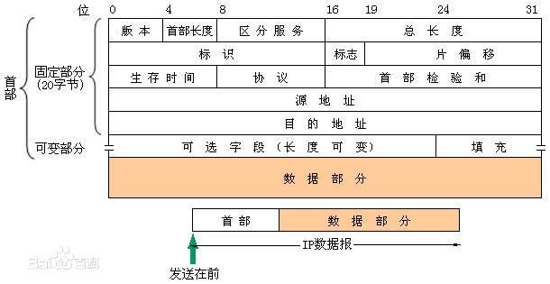

Course_network
===============

数据链路层
--------------
1. 数据单元——**帧**
2. MTU
3. **PPP协议**

网络层
--------
1. 无连接，不可靠
2. **IP**, ARP, ICMP, IGMP
3. IP地址( 分类的IP地址)

     +--------+----------------------+
     |  类别  |     网络号           |
     +--------+----------------------+
     |   A类  |       1——126         |
     +--------+----------------------+
     |   B类  |   128.1——191.255     |
     +--------+----------------------+
     |   C类  | 192.0.1——223.255.255 |
     +--------+----------------------+

   + 1个路由器至少应当有2个不同的IP地址

   + IP地址是网络层及以上使用的逻辑地址，是软件实现的

   + IP数据报首部中的源地址和目的地址始终不变，Mac地址变

   + 路由器只根据目的站的IP地址的 **网络号** 进行路由选择

4. ARP协议

   + 作用: IP地址-->Mac地址

   + ARP高速缓存

   + 流程:

     1. 广播ARP请求，其中也把请求者IP到Mac映射放入请求分组中

     2. 本局域网所有人收到，IP地址配对者 **单播** 响应分组

   + 解决 **同一局域网上** 的映射问题，不在同一局域网，则通过路由器

   + 使用IP及调用ARP原因: 异构网络不同的硬件地址

5. IP数据报

6. IP数据报解释

   + 生存时间： TTL (跳数限制，为0丢弃)

   + 片偏移（8个字节为单位）

7. 分组转发流程

   + 特定主机路由

   + 默认路由

8. IP地址(划分子网)

   + 拿出原主机地址的一部分作为子网号

   + 子网掩码:

     1. IP数据报无法看出所连网络是否划分子网

     2. 子网的网络地址：目标地址 **与** 子网掩码

     3. 默认子网掩码（与网络号对应）

     4. 使用子网的分组转发:
             + 路由表: 目的网络地址、子网掩码、下一跳地址

             + 目的IP地址 **与** 子网掩码，匹配目的网络地址

9. IP地址(构成超网)

运输层
----------
1. 基本概念
^^^^^^^^^^^
   + 通信的端点是主机中的 **进程**

   + 网络层位主机之间提供逻辑通信，运输层位应用进程之间提供端到端的逻辑通信

   + 运输层要进行差错检测，网络层IP数据报只检测首部

   + TCP需要建立连接，不提供广播和多播

   + UDP不需要先建立连接

   +-----------------------------------+-------+
   |           应用层协议              |  UDP  |
   +-----------------------------------+-------+
   |    DNS                            |  UDP  |
   +-----------------------------------+-------+
   |    TFTP(简单文件传送协议)         |  UDP  |
   +-----------------------------------+-------+
   |    RIP(路由信息协议)              |  UDP  |
   +-----------------------------------+-------+
   |    DHCP(动态主机配置协议)         |  UDP  |
   +-----------------------------------+-------+
   |    SNMP(简单网络管理协议)         |  UDP  |
   +-----------------------------------+-------+
   |    NFS(网络文件系统)              |  UDP  |
   +-----------------------------------+-------+
   |    IGMP(网际组管理协议)           |  UDP  |
   +-----------------------------------+-------+

   +-----------------------------------+-------+
   |    SMTP(简单邮件传送协议)         |  TCP  |
   +-----------------------------------+-------+
   |    TELNET(远程终端协议)           |  TCP  |
   +-----------------------------------+-------+
   |    HTTP                           |  TCP  |
   +-----------------------------------+-------+
   |    FTP                            |  TCP  |
   +-----------------------------------+-------+

   +---------+--------+
   | 应用程序|  端口  |
   +---------+--------+
   |   FTP   |   21   |
   +---------+--------+
   |  TELNET |   23   |
   +---------+--------+
   |  SMTP   |   25   |
   +---------+--------+
   |   DNS   |   53   |
   +---------+--------+
   |  TFTP   |   69   |
   +---------+--------+
   |  HTTP   |   80   |
   +---------+--------+
   |  SNMP   |   161  |
   +---------+--------+

2. UDP协议
^^^^^^^^^^

   + 无连接，不可靠，面向报文(保留边界，不拆分)，无拥塞机制(网络出现拥塞发送速率不会降低)

   + 格式(字节)：源端口(2), 目标端口(2)，长度(2),校验和(2)

   + 目标端口不正确，发送ICMP差错报文给发送方

   + 伪首部

3. TCP协议
^^^^^^^^^^

   + 面向连接(打电话)， 可靠，全双工，面向字节流

   + 根据对方给出的窗口值和当前网络拥塞机制决定一个报文段包含的字节数

   + TCP连接的端点叫做 **套接字(IP地址: 端口号)** .

   + **同一个IP地址可以有多个不同的TCP连接，而同一个端口号可以出现在多个不同的TCP连接中** .

   + 自动重传ARQ(发送方超时重传), 连续ARQ(窗口)

4. TCP报文段首部
^^^^^^^^^^^^^^^^
.. image:: TCP.png

5. 首部解释

   + 确认号：若为N，表示N-1之前均已收到

   + ACK: ACK为1时，确认号字段才有效

   + 窗口：允许对方发送的数据量

